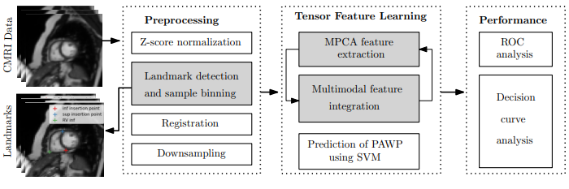
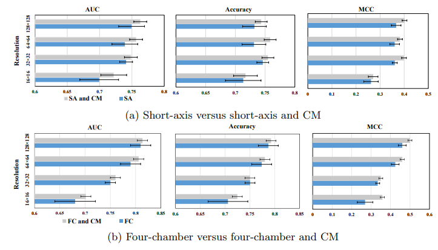
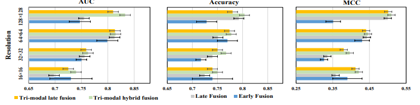
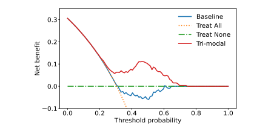

# PAWP Classification

Repository for reproducing experiments in _Tensor-based Multimodal Learning for Prediction of Pulmonary Arterial Wedge Pressure from Cardiac MRI_ [[pre-print]](https://doi.org/10.48550/arXiv.2303.07540)

## Pipeline



## How to run the experiment


## Results







### Citation

```lang-latex
    @inproceedings{PAWP-miccai2023,
      title     = {Tensor-based Multimodal Learning for Prediction of Pulmonary Arterial Wedge Pressure from Cardiac MRI},
      author    = {Prasun C. Tripathi and Mohammod N. I. Suvon and Lawrence Schobs and Shuo Zhou and Samer Alabed and Andrew J. Swift and Haiping Lu},
      booktitle = {Proceedings of the 26th International Conference on Medical Image Computing and Computer Assisted Intervention},
      year      = {2023}
    }
```

## Acknowlegments

The study was supported by the Wellcome Trust grants 215799/Z/19/Z and 205188/Z/16/Z
